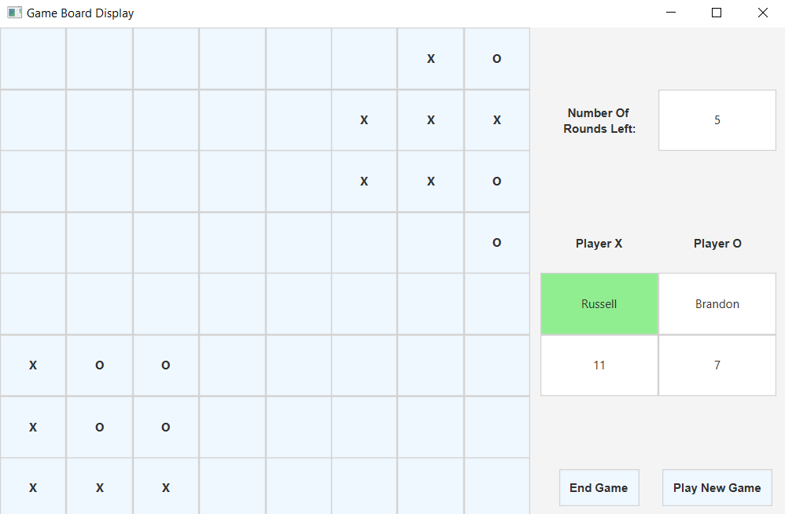
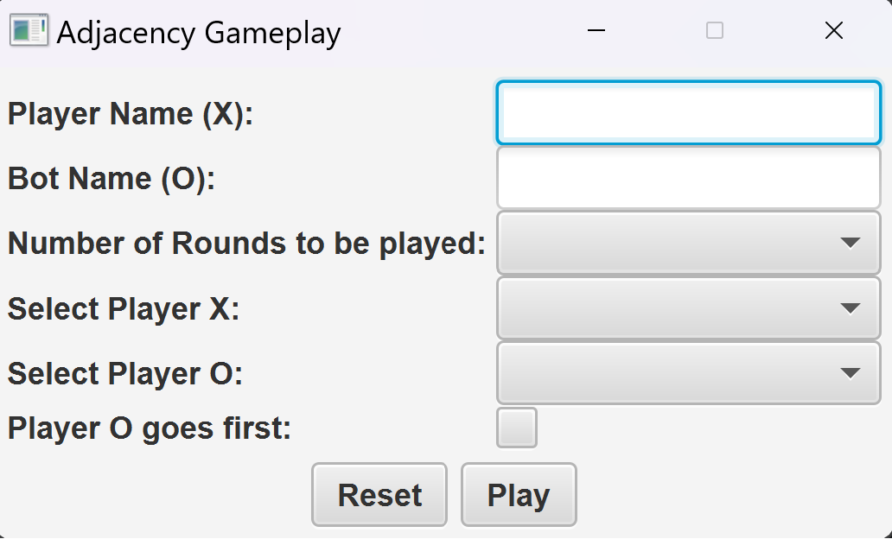
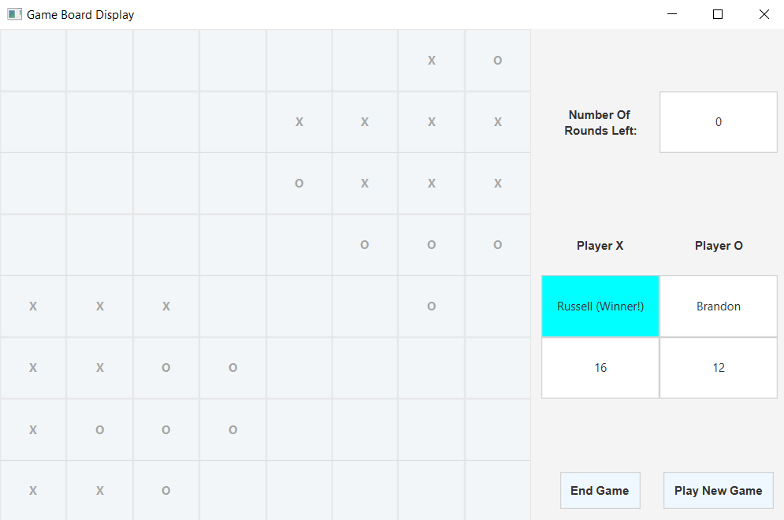

# Adversarial Adjacency-Strategy-Game
<kbd>
  
</kbd>

<hr>

### Introduction
The “Adjacency” program was designed as an interactive and strategic board game that is played between two players. Using X’s and O’s on an 8x8 board outputted on a computer screen, the objective of the game is for a player to get more X’s than O’s in total or vice versa after a specific number of rounds.

The initial game starts with 4 X’s in the bottom left corner and 4 O’s in the top right corner. The first player will begin by placing an X or O on an empty square. In turn, if a player is X, all O’s that are on adjacent squares are then replaced with X’s, and vice versa.

<hr>

### Installation (IntelliJ)
To get started, please install the latest version of the Java Development Kit (JDK) and please install a Java IDE such as <a href="https://www.jetbrains.com/idea/">IntelliJ</a>. Please note that the deployment instructions below use IntelliJ as the IDE.

<hr>

### Installation
1. Make sure you have JDK 11 installed
2. Clone the repo and cd to the folder
``` bash
$ git clone https://github.com/AlifioDitya/Adjacency-Game-AI.git
$ cd adjacency-game-ai
```
3. Run the program

<hr>

For Linux/MacOS:
``` bash
$ ./run.sh
```
For Windows:
``` bash
$ ./run.bat
```

<hr>

### Program Instructions
1. Run the Main class to load the program, and the input window below will pop up. Input the names of Player (X) and Bot (O) into their respective text fields.
Then, select the number of rounds (a number between 2 and 28) to play using the dropdown menu.
Also select the algorithm for the X and O players to use. The options are Human, Minimax, Local Search, and Genetic Algorithm.
You can make the O Player start first.
<br><br><kbd>
</kbd>
<br><br>
2. Click Play, and the gameboard and scoreboard window will load. Human player can play the game by clicking on an empty button. Else, the bot will play the game. 
3. Then, the opposing player will take their turn. Any adjacent symbols will be converted if an opposing symbol is placed beside them.  
NOTE: This process is counted as 1 round (Player and Bot both taking their turns).
4. The game will continue until there are no more rounds left to play. In the end, the player with the greater number of letters is the winner of the game.
<kbd>
  
</kbd>

<hr>

### Notes
<ul>
  <li>Built with <a href="https://openjfx.io/">JavaFX</a></li>
  <li>Initialized by ITB Graphics and AI Lab Assistant 2020</li>
  <li>Finalized by Group 13 & 57 of IF3170 Artificial Intelligence course project</li>
</ul>

<hr>

### Contributors
1. Enrique Alifio Ditya (13521142)
2. Ariel Jovananda (13421086)
3. M. Zulfiansyah Bayu Pratama (13521028)
4. Jauza Lathifah Annassalafi (13521030)

<hr>

### Task Distribution
| Task | Type | Contributors |
| --- | --- | --- |
| Environment | Code | Enrique Alifio Ditya |
| Minimax | Code | Enrique Alifio Ditya |
| Local Search | Code | Enrique Alifio Ditya |
| Genetic Algorithm | Code | M. Zulfiansyah Bayu Pratama |
| Introduction | Report | Enrique Alifio Ditya |
| Minimax | Report | Enrique Alifio Ditya |
| Local Search | Report | Ariel Jovananda |
| Genetic Algorithm | Report | Ariel Jovananda |
| Analysis | Report | Jauza Lathifah Annassalafi |
